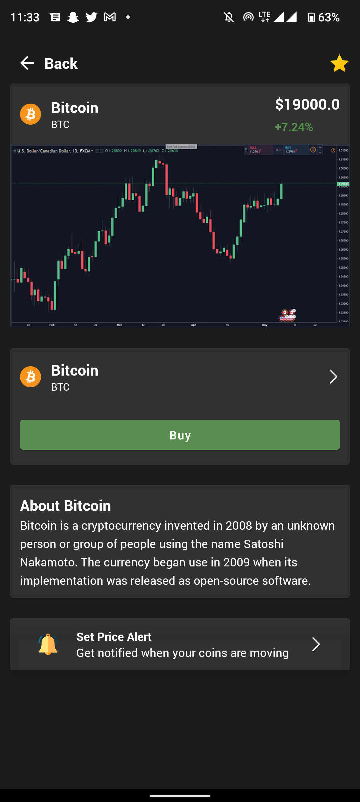
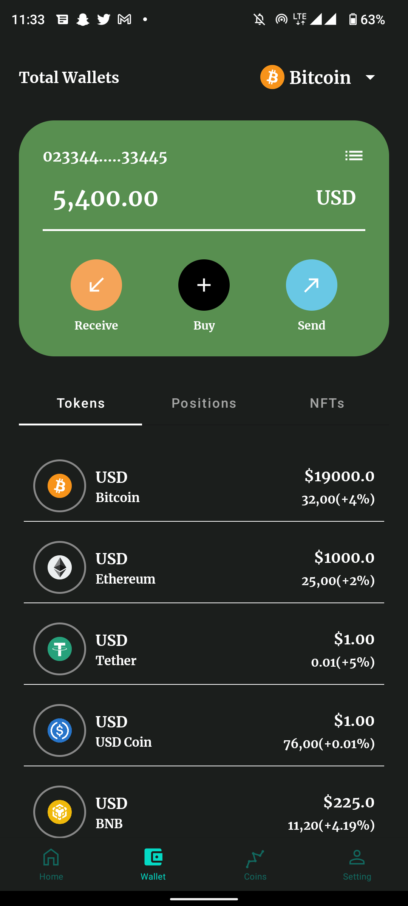
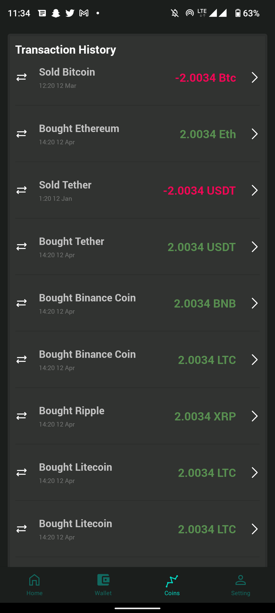
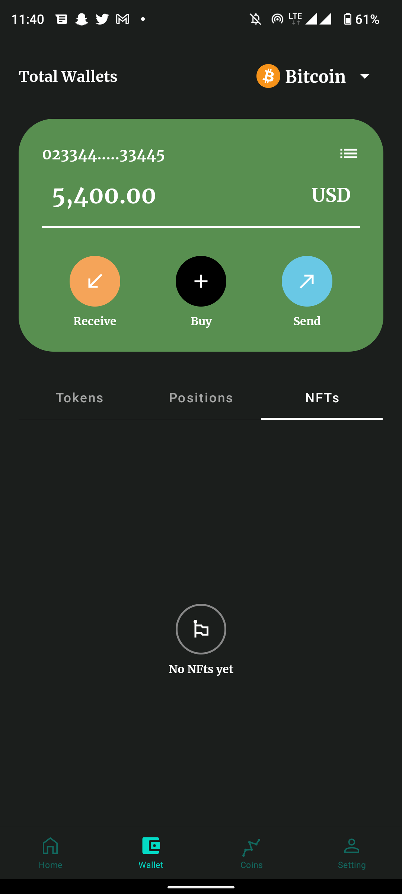
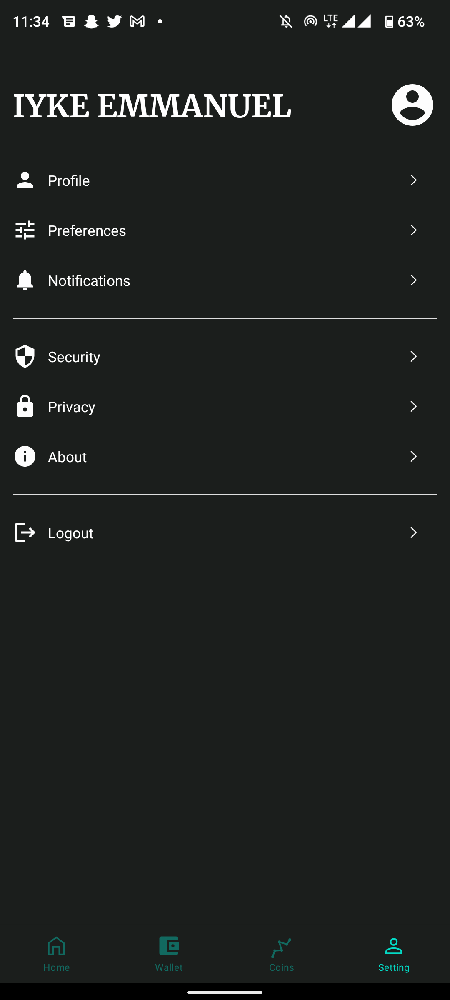

# Compose Crypto Exchange

A Crypto exchange ui using jetpackCompose containing samples that help you learn, understand and implement jetpack compose in your next android project

## Demo

 

<h2 align="left">Screenshots</h2>
<h4 align="start">

 

# Jetpack Compose

Jetpack Compose is Android’s modern toolkit for building native UI. It simplifies and
accelerates UI development on Android. Quickly bring your app to life with less code, powerful tools, and intuitive
Kotlin APIs.

## How to get started

- Please download the Early Access version of
  IntelliJ [from here](https://www.jetbrains.com/idea/nextversion/#section=mac).
- Load the project and run Main.kt
- Start new project from Desktop using Kotlin 1.4.+

## Official Documentations

- Official Google Documentation
    - [Compose for Desktop](https://www.jetbrains.com/lp/compose/)
    - [Jetpack compose](https://developer.android.com/jetpack/compose)
    - [Jetpack compose Samples](https://github.com/android/compose-samples)

## Contribution Info
- All the contributions are welcomed start with the following issues.
    - Support for dark mode
    - Scrollview with recyclerview issue (recyclerView.setNestedScrollingEnabled(false) isn't available in compose)
    - Scrollview goes below bottom navigation view 
    - Thanks happy coding
    
